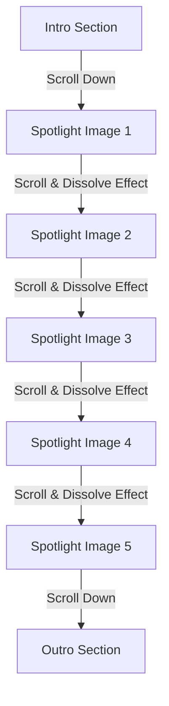

# KVS Services: Scroll-Powered Matrix Image Reveal

An interactive, premium front-end experience featuring a scroll-driven image stack transition combined with a dynamic matrix-style character dissolve effect. Built using **Vite**, **GSAP**, and **Lenis**.

## 🎨 Visual Experience & Architecture

This project is built around three main visual phases linked directly to the user's scroll position:

1. **Intro Section**: A minimalist typographic entry section encouraging users to scroll.
2. **Spotlight Section**: The core interaction. A stack of images that are sequentially revealed using dynamic `clip-path` calculations.
3. **Outro Section**: A final typographic exit section signaling the end of the reveal.



### ⚡ Technology Stack
* **Vite**: Ultra-fast bundler and hot-module-replacement server.
* **GSAP & ScrollTrigger**: Drives the high-performance timeline and scroll synchronization.
* **Lenis**: Next-generation smooth scroll library providing consistent, hardware-accelerated inertia.
* **CSS Clip-Path**: Smooth, non-destructive image mask slicing.
* **Monospace Grid**: A programmatic layout that projects scattering matrix characters during transition.

---

## 🛠️ Installation & Setup

Ensure you have [Node.js](https://nodejs.org/) installed on your machine.

### 1. Clone & Navigate
Navigate into your local project workspace:
```bash
cd "KVS Services"
```

### 2. Install Dependencies
Installs `vite`, `gsap`, `lenis`, and all related node modules:
```bash
npm install
```

### 3. Run Development Server
Launches the Vite local development server and automatically opens the application in your default browser:
```bash
npm run dev
```

### 4. Build for Production
Compiles and bundles the application into a highly optimized output under the `dist/` directory:
```bash
npm run build
```

---

## ⚙️ How the Dissolve Effect Works

The particle/character dissolve effect utilizes a procedural grid system in JavaScript:

* **Matrix Grid Generation**: The script divides the viewport into a grid of cells (`16px` size). Each cell contains a randomized unicode/alphanumeric character.
* **Dynamic Scatter Calculations**: As the scroll transition triggers, a procedural noise generator (`hashFromPosition`) calculates individual scatter offsets and visibility thresholds for each grid cell.
* **Scroll Linkage**: The center of the "dissolve band" moves downwards relative to `ScrollTrigger`'s timeline.
* **Dynamic Density Calculations**: The visual density is calculated as:
  $$\text{density} = (1 - \text{normalizedDistance})^2$$
  If this density matches or exceeds a cell's random seed, the character lights up and fades dynamically.

---

## 📂 Project Structure

```
KVS Services/
├── assets/             # Raw asset imports
├── dist/               # Compiled production bundle
├── node_modules/       # Project dependencies
├── index.html          # Main HTML markup
├── script.js           # Core Scroll & Matrix logic
├── styles.css          # Core Styling & Theme
├── package.json        # Node configuration & scripts
├── vite.config.js      # Vite specific dev configurations
└── .gitignore          # Git exclusion rules
```
